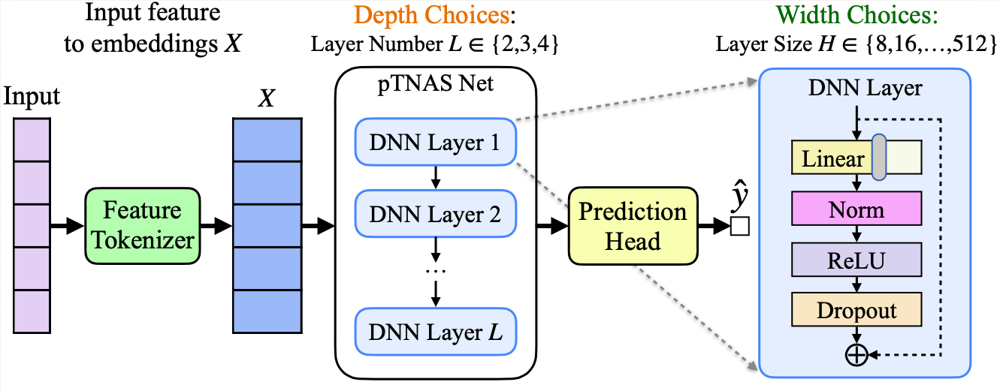
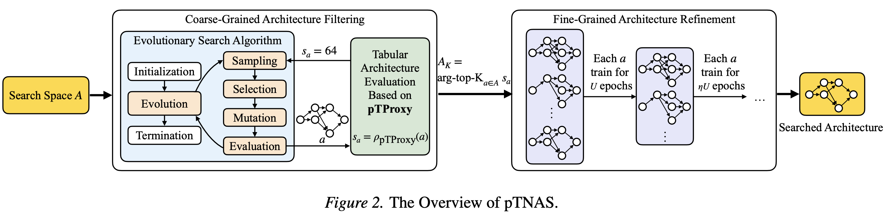
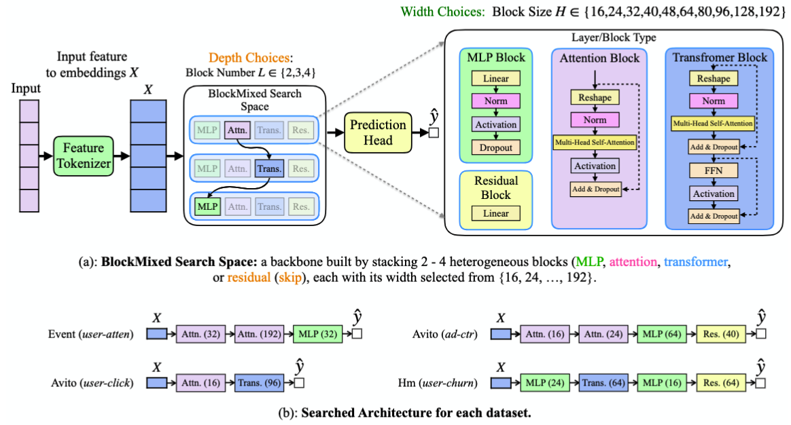

# pTNAS: Progressive Neural Architecture Search for Tabular Data


pTNAS is a progressive neural architecture search framework for tabular data. 

<p align="center">
  
</p>

It uses a two-stage filter-and-refine workflow with budget coordination:

1. **Filtering phase**: scores many candidate architectures with pTProxy, a zero-cost proxy for tabular data.
2. **Refinement phase**: runs Successive Halving on the top candidates.
3. **Budget coordination**: allocates the search budget between the two phases.

<p align="center">
  
</p>

## Data Layout

Download the dataset archive from [Google Drive](https://drive.google.com/file/d/1Be1M0KD7z_YbyrhYSu9_lcfy5_NTueSd/view?usp=sharing).

Expected local paths:

```text
datasets/nas_bench_tabular/
datasets/fit-medium-table/
```

Download the paper-side plotting scripts and compact result files from [Google Drive](https://drive.google.com/file/d/1JpvzcwgPaw4TWVa1Ajmdo8SwFLPldFW-/view?usp=sharing).

```text
run_outputs/ptnas_run_outputs_20260517.tar.gz
```

After downloading, extract it from the repository root:

```bash
tar -xzf run_outputs/ptnas_run_outputs_20260517.tar.gz -C run_outputs
```

## Quick Start

Create the environment:

```bash
conda create -n ptnas python=3.10 -y
conda activate ptnas
pip install -r requirements.txt
```

Set `PYTHONPATH` when running Python scripts from the repo root:

```bash
export PYTHONPATH=src:.
```

### Evaluate Effectiveness on RelBench Datasets

Run the following command to evaluate pTNAS on RelBench datasets:

```bash
# The time budget T_max is set to 10 seconds by default.
bash scripts/run_ptnas_full_time_budget.sh

# Or run pTNAS on one RelBench dataset directly.
python scripts/ptnas_full.py \
  --data_dir datasets/fit-medium-table/event-user-attendance \
  --space_name resnet \
  --output_csv run_outputs/ptnas_run.csv \
  --given_time_budget 10 \
  --device cuda:0
```

Example outputs from a 10-second pTNAS run are tracked as:

```text
run_outputs/example_ptnas_10s.csv
run_outputs/example_ptnas_10s.log
```

Regression uses MAE, so lower is better. Classification uses AUC, so higher is better. Lower ranks indicate better performance.

| Type | Method | Event user-attend | Beer beer-pos | Trial site-success | HM item-sales | Reg. avg rank | Event user-repeat | Beer user-active | Trial study-out | Avito user-click | Cls. avg rank | Global rank |
|---|---|---:|---:|---:|---:|---:|---:|---:|---:|---:|---:|---:|
| CM | LR | 0.3912 | 0.2046 | 0.4594 | 0.0659 | 12.25 | 0.7376 | 0.8812 | 0.6881 | 0.6407 | 11.25 | 11.75 |
| CM | RF | 0.3745 | 0.1997 | 0.4565 | 0.0584 | 10.63 | 0.7270 | 0.8737 | 0.6770 | 0.6450 | 12.75 | 11.69 |
| CM | CatBoost | 0.2607 | 0.1975 | **0.4429** | 0.0557 | 5.75 | 0.7429 | 0.9060 | 0.6945 | 0.6504 | 7.00 | 6.25 |
| CM | LightGBM | 0.2547 | 0.1903 | 0.4595 | **0.0495** | 5.63 | 0.7340 | 0.9061 | 0.6999 | 0.6527 | 7.00 | 6.31 |
| TFM | TabPFN | 0.3406 | 0.1903 | 0.4639 | 0.0583 | 9.88 | **0.7754** | 0.9164 | **0.7051** | 0.6437 | 5.00 | 7.44 |
| TFM | TabICL* | - | - | - | - | - | 0.7692 | 0.9077 | 0.7018 | 0.6503 | **4.50** | **4.50** |
| DTM | DNN | 0.2523 | 0.1947 | 0.4500 | 0.0551 | 5.25 | 0.7294 | 0.9064 | 0.6830 | 0.6546 | 8.25 | 6.75 |
| DTM | DeepFM | **0.2491** | 0.2091 | 0.4581 | 0.0541 | 7.50 | 0.7130 | 0.9047 | 0.7013 | 0.6283 | 10.50 | 9.00 |
| DTM | FTTrans | 0.2539 | **0.1825** | **0.4290** | 0.0584 | **4.13** | 0.7346 | 0.9131 | 0.6836 | 0.6502 | 8.00 | 6.06 |
| DTM | ARM-Net | 0.2642 | 0.1912 | 0.4468 | 0.0515 | 5.50 | 0.7402 | 0.9016 | 0.6965 | **0.6604** | 6.75 | 6.13 |
| LLM | TP-BERTa | 0.2768 | 0.3155 | 0.4612 | 0.3514 | 13.75 | 0.5457 | 0.5170 | - | 0.5122 | 16.00 | 14.71 |
| LLM | Nomic | 0.2677 | 0.3439 | 0.4545 | 0.2063 | 12.25 | 0.6896 | 0.8896 | 0.6533 | 0.5771 | 13.75 | 13.00 |
| LLM | BGE | 0.2645 | 0.2829 | 0.4511 | 0.0772 | 10.50 | 0.6787 | 0.8868 | 0.6503 | 0.6462 | 13.25 | 11.88 |
| NAS (10s) | TabNAS | 0.2635 | 0.1994 | 0.4520 | 0.0507 | 6.50 | 0.7512 | **0.9357** | 0.6902 | 0.6480 | 6.00 | 6.25 |
| NAS (10s) | EA-NAS | 0.2639 | 0.2002 | 0.4485 | 0.0797 | 9.00 | 0.7518 | 0.9227 | 0.7017 | 0.6473 | 5.00 | 7.00 |
| NAS (10s) | **pTNAS** | **0.2432** | **0.1794** | 0.4466 | **0.0497** | **1.75** | **0.7769** | **0.9370** | **0.7068** | **0.6680** | **1.00** | **1.38** |

*TabICL is classification-only and is not applicable to regression tasks.*

The pTNAS row above is produced by searching in Space 1. The selected model structures from `run_outputs/example_ptnas_10s.csv` are:

| Event user-attend | Beer beer-pos | Trial site-success | HM item-sales | Event user-repeat | Beer user-active | Trial study-out | Avito user-click |
|---|---|---|---|---|---|---|---|
| `[64, 256, 128, 256]` | `[256, 128, 256, 128]` | `[256, 128, 64, 256]` | `[256, 256, 128, 256]` | `[256, 256, 64, 256]` | `[128, 256, 64, 256]` | `[32, 256, 64, 256]` | `[64, 256, 128, 256]` |

## Additional Search Space and Search Results

<p align="center">
  
</p>

## Detailed Reproduction

Use [`doc/reproduce.md`](doc/reproduce.md) for additional evaluation results and reproduction details.
